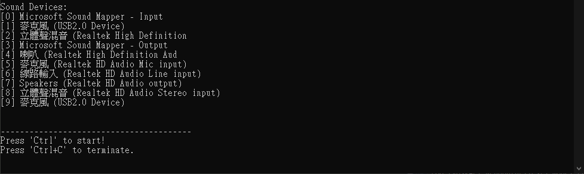
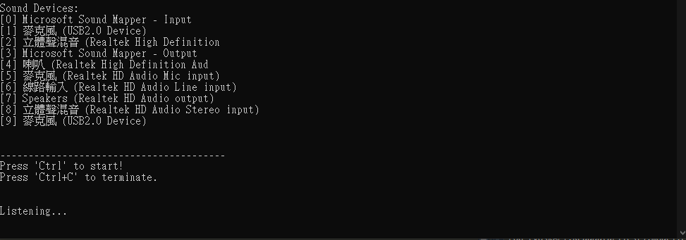
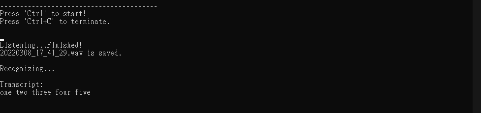
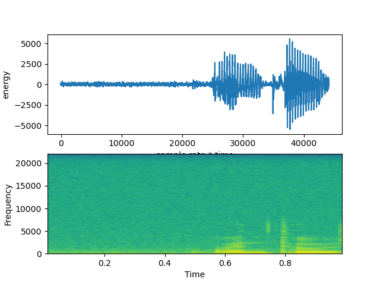

# Speech_to_Text_Vosk
A real time speech recognition program using microphone based on [Vosk](https://alphacephei.com/vosk/) - an open source speech recognition open source toolkit.

## How to use
1. Install the necessary libaries. 
    * [Vosk](https://alphacephei.com/vosk/install)
    * [SpeechRecognition ](https://pypi.org/project/SpeechRecognition/)
    * [PyAudio](https://pypi.org/project/PyAudio/)
    * ... 

2. Download the models from [Vosk models](https://alphacephei.com/vosk/models).
3. Arrange your project directory structure like this:
    ```
    Project
    │   vosk_microphone_speech2text.py
    │
    └───Models
    │       vosk-model-small-en-us-0.15
    |       vosk-model-en-us-0.22-lgraph
    │       ...
    |
    └───Recording
    ```

## Screen shot
### 1. Start the program

### 2. Press Ctrl to start recording

### 3. Speech to text

### 4. Plot the time domain and frequency domain of the recorded sound

